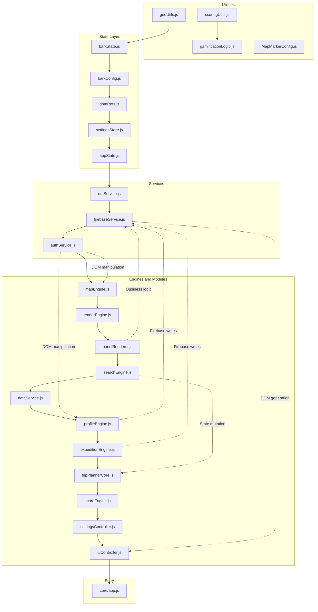

# B.A.R.K. Ranger Map — Production-Grade Architecture Audit

**Audit Date:** 2026-04-27  
**Auditor Role:** Principal Software Architect / Staff Engineer  
**Codebase Version:** v26 (Post-Refactor)  
**Scope:** Full architectural and production-readiness audit

---

## 1. EXECUTIVE SUMMARY

### Overall Architecture Rating: **5.5 / 10**

The refactor moved in the right direction by introducing file-level separation and a namespace-based module system. However, it is **structurally incomplete**. The architecture is a "Phase 1.5" outcome — files are split, but the dependency graph, state ownership, and coupling model remain fundamentally tied to `window.*` globals. The refactor created the *appearance* of modularity without achieving the *substance* of it.

### Biggest Strength
The **rendering heartbeat** (`syncState()` in [`renderEngine.js`](modules/renderEngine.js:76)) is well-designed. It uses `requestAnimationFrame` to batch DOM writes and prevent layout thrashing. The CSS-only marker visibility system (`.marker-filter-hidden` class toggle instead of Leaflet `addLayer`/`removeLayer`) is a genuine performance win that will scale to 1,000+ pins without issue.

### Biggest Remaining Risk
**`authService.js`** is a **god function disguised as a service**. The [`initFirebase()`](services/authService.js:10) function is a 390-line monolith that handles Firebase initialization, auth state management, cloud settings hydration, DOM manipulation, expedition UI orchestration, admin dashboard rendering, streak management, leaderboard triggering, and premium feature gating — all inside a single `onAuthStateChanged` callback. A single regression here cascades across **every feature** in the app.

### Would you deploy this to 10k users? **No — but close.**

The app will *function* at 10k users but will hit Firebase quota issues within the first week, encounter race conditions during rapid auth state changes, and suffer from memory leaks on long-lived mobile sessions. The **minimum work** to reach deployable status is approximately 5-8 focused changes (detailed in Section 8).

---

## 2. ARCHITECTURE HEALTH MAP

### ✅ What Is Clean

| Module | Verdict | Why |
|--------|---------|-----|
| [`utils/geoUtils.js`](utils/geoUtils.js:1) | **Clean** | Pure functions, no side effects, no dependencies |
| [`utils/scoringUtils.js`](utils/scoringUtils.js:1) | **Clean** | Single-authority scoring formula, deterministic |
| [`services/orsService.js`](services/orsService.js:1) | **Clean** | Proper async/await, error handling, no DOM access, proper service boundary |
| [`config/domRefs.js`](config/domRefs.js:1) | **Clean** | Lazy-evaluated DOM refs prevent stale references |
| [`modules/barkConfig.js`](modules/barkConfig.js:1) | **Clean** | Pure constants, no logic |
| [`gamificationLogic.js`](gamificationLogic.js:1) | **Clean** | Class-based, deterministic evaluation, session-stable timestamps |
| [`MapMarkerConfig.js`](MapMarkerConfig.js:1) | **Clean** | Factory pattern, pure output, no side effects |
| [`modules/renderEngine.js`](modules/renderEngine.js:1) | **Mostly Clean** | Good batching, but `syncState()` triggers achievement evaluation which has Firebase side effects |

### ⚠️ What Is Partially Clean

| Module | Verdict | Why |
|--------|---------|-----|
| [`modules/barkState.js`](modules/barkState.js:1) | **Partial** | Good state ownership but exposes everything on `window.*`, making it impossible to enforce access control |
| [`state/appState.js`](state/appState.js:1) | **Partial** | Well-structured get/set/onChange API, but the `installLegacyWindowMirrors()` pattern means any code can bypass it via `window.allPoints = ...` |
| [`state/settingsStore.js`](state/settingsStore.js:1) | **Partial** | Good derived-key pattern for `clusteringEnabled`, but hydration reads from `window.*` globals that were set by `barkState.js`, creating load-order fragility |
| [`modules/searchEngine.js`](modules/searchEngine.js:1) | **Partial** | Good fuzzy search with Levenshtein caching, but geocode function mixes trip planner state mutation with search UI logic |
| [`modules/mapEngine.js`](modules/mapEngine.js:1) | **Partial** | Clean initialization, good performance options, but the one-finger zoom engine is 75 lines of touch event handling embedded in the init function |
| [`engines/tripPlannerCore.js`](engines/tripPlannerCore.js:1) | **Partial** | Self-contained trip logic, but `updateTripUI()` is a 150-line function that generates HTML strings inline |

### 🔴 What Is Still Structurally Risky

| Module | Verdict | Why |
|--------|---------|-----|
| [`services/authService.js`](services/authService.js:1) | **Risky** | 390-line `initFirebase()` is a god function. Handles auth, settings hydration, expedition UI, admin rendering, streak logic, and premium gating in one closure |
| [`services/firebaseService.js`](services/firebaseService.js:1) | **Risky** | `loadSavedRoutes()` generates DOM elements, binds click handlers, and manages pagination state — this is a renderer pretending to be a service |
| [`modules/dataService.js`](modules/dataService.js:1) | **Risky** | `processParsedResults()` does CSV parsing, marker creation, DOM reference capture, event binding, and gamification hydration — it's the old monolith split into a file but not decomposed |
| [`renderers/panelRenderer.js`](renderers/panelRenderer.js:1) | **Risky** | Contains GPS check-in business logic (haversine validation, visit recording, streak incrementing) inside what should be a pure UI renderer |
| [`modules/profileEngine.js`](modules/profileEngine.js:1) | **Risky** | `evaluateAchievements()` does Firebase writes (leaderboard sync), DOM rendering, achievement evaluation, and state badge sorting in a single 230-line function |
| [`modules/expeditionEngine.js`](modules/expeditionEngine.js:1) | **Risky** | Direct Firebase reads/writes scattered throughout, DOM manipulation mixed with business logic, WalkTracker singleton with mutable state |

---

## 3. CRITICAL RISKS (TOP 5)

### P0 — `authService.initFirebase()` is a Single Point of Total Failure

**Location:** [`services/authService.js:24-347`](services/authService.js:24)

The `onAuthStateChanged` callback is a 320-line function that:
- Hydrates cloud settings (17 individual `window.*` assignments at lines 97-119)
- Renders admin dashboard HTML (lines 181-194)
- Manages expedition UI state (lines 218-257)
- Triggers leaderboard loading
- Updates visited pin button state
- Manages premium filter gating

**Failure Mode:** Any exception inside this callback silently breaks the entire auth lifecycle. A `null` in `data.virtual_expedition.trail_name` (line 236) would crash the callback, preventing visited places from loading, leaderboard from populating, and settings from hydrating.

**Evidence:** Line 111 — `if (typeof map !== 'undefined')` — references bare `map` global without `window.` prefix, which could throw a ReferenceError in strict mode.

---

### P0 — Triple State Ownership Creates Unresolvable Race Conditions

**Location:** [`modules/barkState.js`](modules/barkState.js:1), [`state/appState.js`](state/appState.js:1), [`state/settingsStore.js`](state/settingsStore.js:1)

There are **three** state management systems running simultaneously:

1. **`barkState.js`** — Sets `window.*` globals directly (line 15-58), defines `Object.defineProperties` on `window.BARK` (line 129-140)
2. **`state/appState.js`** — Wraps `window.BARK.*` with get/set/onChange, then mirrors back to `window.*` via `Object.defineProperty` (line 136-146)
3. **`state/settingsStore.js`** — Independent store that also installs `Object.defineProperty` on `window.*` (line 148-171)

**Race Condition:** When `authService.js` line 97 does `window.allowUncheck = applySetting(...)`, this triggers the `settingsStore` setter (because of the defineProperty mirror), which calls `persist()` to localStorage. But the `settingsStore` was hydrated from those same `window.*` globals that `barkState.js` set. If `barkState.js` hasn't finished loading when `settingsStore.js` hydrates, values are `undefined` → `false`.

**Evidence:** `settingsStore.js` line 136 does `values[key] = normalizeBoolean(window[key])` — if `barkState.js` hasn't set `window.allowUncheck` yet, this normalizes `undefined` → `false`, overwriting the user's localStorage preference.

---

### P1 — Firebase Quota Abuse via Unbounded `onSnapshot` + `syncState` Loop

**Location:** [`services/authService.js:72`](services/authService.js:72), [`modules/renderEngine.js:76`](modules/renderEngine.js:76)

The `onSnapshot` listener on the user document (line 72) fires on every Firestore document change. Each time:
1. It calls `window.syncState()` (line 275)
2. `syncState()` triggers `evaluateAchievements()` (line 88-93)
3. `evaluateAchievements()` calls `syncScoreToLeaderboard()` (line 171 of profileEngine.js)
4. `syncScoreToLeaderboard()` does `db.collection('users').doc(user.uid).set(...)` (line 91-96 of profileEngine.js)
5. This triggers the `onSnapshot` listener again → **LOOP**

**Mitigation Exists But Is Fragile:** `_lastSyncedScore` check (line 86 of profileEngine.js) prevents infinite loops only when the score doesn't change. But during initial login when `_lastSyncedScore` is `-1` (line 63 of authService.js), the first sync always triggers a write, which triggers a snapshot, which triggers another sync.

**Estimated Impact:** Each session could generate **15-40 unnecessary Firestore writes** during the login hydration phase. At 10k users with daily sessions, that's 150k-400k extra writes/day.

---

### P1 — `firebaseService.loadSavedRoutes()` Generates DOM Inside a Service

**Location:** [`services/firebaseService.js:120-262`](services/firebaseService.js:120)

This function:
- Creates DOM elements via `document.createElement()` (line 186)
- Sets inline HTML with template literals (line 187-199)
- Binds `onclick` handlers inside the loop (lines 203-229, 232-244)
- Manages pagination state (`window._lastSavedRouteDoc`)
- Navigates the UI by simulating a click: `document.querySelector('[data-target="map-view"]')?.click()` (line 224)

This is not a service. It's a combined renderer + controller + data layer in a file named "service." Any future change to the routes UI will require modifying this "service," making it a regression hotspot.

---

### P2 — `panelRenderer.js` Contains Critical Business Logic

**Location:** [`renderers/panelRenderer.js:221-299`](renderers/panelRenderer.js:221)

The GPS check-in flow (the core product feature) lives inside a renderer:
- Geolocation API call (line 225)
- Haversine distance validation (line 226)
- Visit object construction (line 229)
- Firebase write to `updateCurrentUserVisitedPlaces()` (line 233)
- State mutation of `userVisitedPlaces` Map (line 231)
- Streak increment (line 249)

**Risk:** If a designer changes the panel layout and accidentally removes or restructures the button, the entire check-in system breaks. Business logic should never be co-located with UI rendering.

---

## 4. HIDDEN TECHNICAL DEBT

### 4.1 — The `window.BARK` Namespace Is a Global Object, Not a Module System

Every file does `window.BARK = window.BARK || {}` and attaches functions. This means:
- No import/export → no static analysis possible
- No tree-shaking → dead code is invisible
- Name collisions are silent → `window.BARK.loadData` could be overwritten by any file
- Load order is **catastrophic** if any `<script defer>` tag is reordered in [`index.html`](index.html:1276-1303)

**Evidence:** [`modules/barkState.js:114-119`](modules/barkState.js:114) throws a hard error if `geoUtils.js` hasn't loaded first. This is a runtime dependency check that wouldn't be necessary with ES modules.

### 4.2 — Inline `onclick` Handlers in HTML Template Strings

Multiple files generate HTML with inline handlers:
- [`index.html:412`](index.html:412): `onclick="autoSortDay()"`
- [`index.html:424`](index.html:424): `onclick="togglePlannerRoutes()"`
- [`index.html:893`](index.html:893): `onclick="shareSingleExpedition()"`
- [`index.html:897`](index.html:897): `onclick="claimRewardAndReset()"`

These require functions to be on the `window` object, which is why every module still exports to `window.*`. This creates an **escape hatch** that makes the `window.BARK` namespace pattern unenforceable.

### 4.3 — Dual Scroll Container Problem

The route list in [`engines/tripPlannerCore.js`](engines/tripPlannerCore.js:392) generates a `max-height: 45vh` scrollable list. The expedition history in [`modules/expeditionEngine.js`](modules/expeditionEngine.js:377) generates a `max-height: 180px` scrollable list. Both are inside the profile view which itself scrolls. On iOS, nested scrollable containers cause touch event confusion and "stuck scroll" behavior.

### 4.4 — `_lastSavedRouteDoc` Uses `window` as Pagination State

[`services/firebaseService.js:8`](services/firebaseService.js:8): `window._lastSavedRouteDoc = window._lastSavedRouteDoc || null;`

This is a Firestore `DocumentSnapshot` stored on the global `window` object. It's used for cursor-based pagination. If the user switches accounts without a full page reload, this stale cursor points to the **previous user's** documents.

### 4.5 — Firebase API Key Exposed in Client Code

[`modules/barkConfig.js:24`](modules/barkConfig.js:24): The Firebase API key and ORS API key are hardcoded in the client. For Firebase, this is technically acceptable when Firestore Security Rules are properly configured. For the ORS API key ([`modules/barkConfig.js:35`](modules/barkConfig.js:35)), this is a **quota abuse vector** — anyone can extract the key and use the route planning API.

---

## 5. PERFORMANCE ANALYSIS

### 5.1 — Map Rendering

**Marker creation:** Each CSV parse cycle in [`dataService.js:48-123`](modules/dataService.js:48) destroys ALL markers (`markerLayer.clearLayers()` on line 44) and recreates them. For ~1,000 pins, this means:
- 1,000 `L.marker()` instantiations
- 1,000 `L.divIcon()` instantiations
- 1,000 DOM nodes created
- 1,000 event listeners bound

This happens on **every CSV poll** (every 10 seconds if the hash changes). The `_layerAdded` flag in [`renderEngine.js:158`](modules/renderEngine.js:158) prevents duplicate layer additions during `updateMarkers()`, but marker creation itself is unbounded.

**CSS visibility toggle:** The `.marker-filter-hidden` approach ([`renderEngine.js:175-177`](modules/renderEngine.js:175)) is excellent. It avoids Leaflet's expensive `addLayer`/`removeLayer` cycle and keeps the cluster group stable. This is one of the best patterns in the codebase.

**Cluster configuration:** The dynamic `maxClusterRadius` function ([`mapEngine.js:261-269`](modules/mapEngine.js:261)) appropriately adjusts clustering aggression based on zoom level. `removeOutsideVisibleBounds: false` on line 257 means markers are kept in memory even when off-screen — this trades memory for smoother panning. At 1,000 pins, memory usage should be ~15-25MB, which is acceptable.

**Verdict: Map will handle 1,000 pins adequately. The main bottleneck is marker recreation during CSV polls, not rendering.**

### 5.2 — Firebase Usage

**Reads per session (authenticated user):**
| Operation | Count | Source |
|-----------|-------|--------|
| `onSnapshot` user doc | 1 listener (fires N times) | [`authService.js:72`](services/authService.js:72) |
| `loadSavedRoutes` | 1-3 reads | [`firebaseService.js:142-152`](services/firebaseService.js:142) |
| `loadLeaderboard` | 1-2 reads | [`profileEngine.js:533-534`](modules/profileEngine.js:533) |
| Achievement cache fetch | 1 read (then cached) | [`gamificationLogic.js:128-129`](gamificationLogic.js:128) |
| REST API rank aggregate | 1-2 reads | [`profileEngine.js:552-562`](modules/profileEngine.js:552) |
| Version poll | ~1/30s | [`dataService.js:328-348`](modules/dataService.js:328) |

**Writes per session:**
| Operation | Count | Source |
|-----------|-------|--------|
| Leaderboard sync | 2 writes (users + leaderboard) | [`profileEngine.js:91-105`](modules/profileEngine.js:91) |
| Achievement batch | 1 batch write | [`gamificationLogic.js:158`](gamificationLogic.js:158) |
| Settings save (manual) | 1 write | [`settingsController.js:314`](modules/settingsController.js:314) |
| Streak increment | 1 write | [`firebaseService.js:41-44`](services/firebaseService.js:41) |
| Visit marking | 1 write | [`firebaseService.js:85`](services/firebaseService.js:85) |

**Safety valve:** The `incrementRequestCount()` function ([`barkState.js:78-84`](modules/barkState.js:78)) caps at 600 requests/session. This is good but crude — it counts reads and writes equally and doesn't distinguish between cheap reads and expensive writes.

**Verdict: Firebase usage is controllable but poorly optimized. The snapshot → sync → write → snapshot loop is the primary concern.**

### 5.3 — DOM Update Efficiency

The `safeUpdateHTML()` function ([`renderEngine.js:63-68`](modules/renderEngine.js:63)) prevents unnecessary DOM writes by comparing innerHTML. This is a good micro-optimization but has a subtle flaw: `innerHTML` comparison is O(n) on the string length, and for the achievement vault grids with hundreds of badge HTML strings, this comparison itself becomes expensive.

The `syncState()` batching via `requestAnimationFrame` ([`renderEngine.js:76-95`](modules/renderEngine.js:76)) is correctly implemented and prevents cascading reflows.

**Verdict: DOM efficiency is above average for a vanilla JS app. The main concern is the frequency of full re-renders triggered by the snapshot listener.**

---

## 6. SCALABILITY ASSESSMENT

### What Breaks at 1,000 Users

**Nothing critical.** Firebase free tier allows 50k reads/day and 20k writes/day. At 1k users with ~50 reads and ~10 writes per session, you'd use ~50k reads and ~10k writes — right at the limit. **The version poll** ([`dataService.js:328`](modules/dataService.js:328)) fetching `version.json` every 30 seconds is a static file — no Firebase cost.

### What Breaks at 10,000 Users

1. **Firebase Firestore quotas exceeded.** 10k users × 50 reads = 500k reads/day. Free tier is 50k. Even Spark+Blaze plans will incur significant cost.

2. **Leaderboard aggregation query** ([`profileEngine.js:552-562`](modules/profileEngine.js:552)) does a REST API aggregation query for rank calculation on every login. This is O(n) on the leaderboard collection size. At 10k users, this query will become slow and expensive.

3. **Google Sheets CSV endpoint throttling.** The data source ([`dataService.js:199`](modules/dataService.js:199)) fetches from a published Google Sheets CSV. Google Sheets has undocumented rate limits — at 10k concurrent users polling every 10 seconds, you'll hit HTTP 429 errors.

4. **`onSnapshot` multiplexing.** Each authenticated user opens a real-time listener on their user document. Firestore can handle this, but the **backend fan-out cost** for any system-wide change that touches user documents would be enormous.

### What Breaks at 1,000 Pins

**Nothing.** The current architecture handles 1k pins well because:
- Leaflet's `L.canvas()` renderer is used ([`mapEngine.js:64`](modules/mapEngine.js:64))  
- Marker clustering with configurable radius works correctly
- CSS visibility toggle avoids Leaflet layer operations
- Viewport culling option available for low-end devices

At **5,000+ pins**, the CSV parsing and marker recreation cycle would become a bottleneck (5,000 DOM nodes created per poll). At that scale, a stable marker cache is mandatory.

---

## 7. REGRESSION RISK ANALYSIS

### Fragile Hotspots (Ranked by Danger)

| Rank | Module | Risk Level | Why |
|------|--------|-----------|-----|
| 1 | [`services/authService.js`](services/authService.js:1) | 🔴 Critical | Any change to the `onAuthStateChanged` callback risks breaking auth, settings, expedition, or premium features |
| 2 | [`modules/dataService.js`](modules/dataService.js:48) | 🔴 Critical | `processParsedResults()` is the single CSV→marker pipeline; breaking it breaks the entire map |
| 3 | Script load order in [`index.html:1276-1303`](index.html:1276) | 🔴 Critical | Reordering any `<script>` tag will cause runtime errors due to implicit dependencies |
| 4 | [`modules/barkState.js`](modules/barkState.js:1) | 🟡 High | All window globals originate here; any rename breaks downstream consumers silently |
| 5 | [`renderers/panelRenderer.js`](renderers/panelRenderer.js:221) | 🟡 High | GPS check-in logic inside renderer; UI changes risk breaking business logic |
| 6 | [`modules/profileEngine.js`](modules/profileEngine.js:131) | 🟡 High | `evaluateAchievements()` combines rendering + Firebase + scoring; changing badge UI risks data corruption |
| 7 | [`modules/settingsController.js`](modules/settingsController.js:207) | 🟠 Medium | Simplify trails toggle (line 207) does a Firebase read inside a settings change handler |

### Where Future Changes Are Dangerous

1. **Adding a new setting:** Requires changes in `barkState.js` (localStorage hydration), `settingsStore.js` (STORAGE_KEYS), `appState.js` (APP_STATE_KEYS if applicable), `authService.js` (cloud settings hydration block), `settingsController.js` (toggle binding), `index.html` (HTML toggle element), and `config/domRefs.js` (DOM reference). **7 files** for one toggle.

2. **Changing the check-in radius:** Requires modifying [`panelRenderer.js:227`](renderers/panelRenderer.js:227) (the `dist <= 25` check). This constant is hardcoded inline inside an onclick handler inside a renderer, not in config.

3. **Adding a new map pin type:** Requires changes in [`renderEngine.js`](modules/renderEngine.js:9) (`getColor`, `getBadgeClass`), [`MapMarkerConfig.js`](MapMarkerConfig.js:15) (icon selection), CSV column parsing in [`dataService.js`](modules/dataService.js:76), and filter button HTML in [`index.html`](index.html:79-98).

---

## 8. RECOMMENDED NEXT PHASE (PRIORITIZED ROADMAP)

### Priority 1 — Break Up `authService.initFirebase()` (Impact: 🔴 Critical, Effort: Medium)

Extract the `onAuthStateChanged` callback into discrete handlers:
- `handleCloudSettingsHydration(data)`
- `handleExpeditionSync(data)`
- `handleAdminCheck(data, user)`
- `handleVisitedPlacesSync(placeList)`
- `handlePremiumGating(isLoggedIn)`

Each handler should be independently testable and independently fail-safe with try/catch.

### Priority 2 — Extract Business Logic from `panelRenderer.js` (Impact: 🔴 Critical, Effort: Low)

Move the GPS check-in flow (lines 221-299) into a new `services/checkinService.js`:
- `verifyGpsCheckin(parkData, userVisitedPlaces)` → returns `{success, distance, newVisitObj}`
- `markAsVisited(parkData, userVisitedPlaces)` → returns updated array
- `removeVisit(parkData, userVisitedPlaces)` → returns updated array

The renderer then only calls these services and updates the UI based on the result.

### Priority 3 — Break the `onSnapshot` → `syncScoreToLeaderboard` → `onSnapshot` Loop (Impact: 🔴 Critical, Effort: Low)

Add a `_leaderboardSyncInProgress` flag to prevent re-entrant syncs:
```js
if (_leaderboardSyncInProgress) return;
_leaderboardSyncInProgress = true;
try { /* sync */ } finally { _leaderboardSyncInProgress = false; }
```
Also add a `_lastLeaderboardSyncTime` debounce (minimum 10 seconds between syncs).

### Priority 4 — Extract DOM Generation from `firebaseService.loadSavedRoutes()` (Impact: 🟡 High, Effort: Medium)

Split into:
- `firebaseService.fetchSavedRoutes(uid, cursor)` → returns `{routes: [], nextCursor}`
- `routeRenderer.renderRoutesList(routes, container, callbacks)` → pure DOM generation

### Priority 5 — Implement Stable Marker Cache in `dataService.processParsedResults()` (Impact: 🟡 High, Effort: Medium)

Instead of `markerLayer.clearLayers()` on every CSV update, diff the new dataset against the existing `parkLookup` Map:
- New pins → create marker
- Changed pins → update `_parkData`
- Removed pins → remove marker
- Unchanged pins → skip

This eliminates the 1,000-marker destruction/recreation cycle on each poll.

### Priority 6 — Remove Inline `onclick` Handlers from `index.html` (Impact: 🟡 High, Effort: Low)

Replace all `onclick="functionName()"` attributes with event listener bindings in the respective modules. This removes the requirement for functions to be on the `window` object and enables the path toward eliminating `window.*` globals.

### Priority 7 — Add Error Boundaries to Critical Paths (Impact: 🟠 Medium, Effort: Low)

Wrap these critical sections in try/catch with user-facing fallback:
- `processParsedResults()` — show "Map data loading failed" overlay
- `onAuthStateChanged` callback — show "Session error" toast + force re-auth
- `evaluateAchievements()` — silently degrade (show stale badges, don't crash profile)

### Priority 8 — Move Check-in Radius to Config (Impact: 🟢 Low, Effort: Trivial)

Extract the `25` km radius constant from [`panelRenderer.js:227`](renderers/panelRenderer.js:227) to `barkConfig.js` as `window.BARK.config.CHECKIN_RADIUS_KM = 25`.

---

## 9. ROUTE PLANNER SAFETY ANALYSIS

### Is the Route Planner Being Indirectly Modified?

**No.** The route planner ([`engines/tripPlannerCore.js`](engines/tripPlannerCore.js:1)) is well-isolated. It:
- Reads state from `window.BARK.tripDays` and `window.BARK.activeDayIdx` only
- Writes to those same state variables only
- Uses `window.BARK.services.ors.directions()` for external API calls
- Has no Firebase dependencies for core trip logic (only for saving/loading)

### Hidden Coupling Risks

1. **`window.addStopToTrip`** is called from [`panelRenderer.js:149`](renderers/panelRenderer.js:149) via the slide panel "Add to Trip" button. If the trip planner's data contract changes (e.g., stop object shape), the panel renderer breaks silently.

2. **`executeGeocode()`** in [`searchEngine.js:252`](modules/searchEngine.js:252) directly mutates `window.tripStartNode` and `window.tripEndNode` (lines 269-270), bypassing the trip planner's own state management. This is a **hidden write** that the trip planner doesn't control.

3. **Saved route loading** in [`firebaseService.js:213`](services/firebaseService.js:213) directly assigns `window.BARK.tripDays` and `window.BARK.activeDayIdx`, then calls `window.BARK.updateTripUI()`. This bypasses any future validation the trip planner might add.

### Correctness Preservation Risk: **Low-Medium**

The route planner itself is stable. The risk comes from external modules writing to its state variables without going through a controlled API.

---

## 10. GAMIFICATION SYSTEM ANALYSIS

### Is Scoring Deterministic?

**Yes.** The formula in [`scoringUtils.js:26-33`](utils/scoringUtils.js:26) is:
```
totalScore = (verifiedCount × 2) + regularCount + sanitizeWalkPoints(walkPoints)
```
`sanitizeWalkPoints()` uses `Math.floor(Math.round(raw * 100) / 100)` which is deterministic. The formula is centralized in one file — good.

### Is Leaderboard Consistency Guaranteed?

**No.** There are two places where leaderboard data is written:
1. [`profileEngine.js:91-105`](modules/profileEngine.js:91) — `syncScoreToLeaderboard()` writes to both `users/{uid}` and `leaderboard/{uid}`
2. These writes are **not atomic** — if the first succeeds and the second fails, the user's score and leaderboard score diverge

Additionally, the `cachedLeaderboardData` array (line 76 of profileEngine.js) is mutated in-place during `syncScoreToLeaderboard()` (lines 109-124). If the render cycle reads this array mid-mutation, the UI could show inconsistent data.

### Are Badge Calculations Centralized?

**Yes.** All badge evaluation flows through `GamificationEngine.evaluate()` ([`gamificationLogic.js:57`](gamificationLogic.js:57)). The session-level timestamp cache (`_sessionTimestamps` at line 19) prevents badge dates from flickering on re-evaluation. The achievement DB cache (`achievementsCache` at line 18) prevents redundant Firestore reads. Both are well-designed.

---

## 11. FINAL VERDICT

### Is This Production-Ready?

**Not yet, but it's deployable as a beta/soft-launch.**

The app will work for casual use by hundreds of users. It will encounter issues at scale due to:
1. Firebase write loops during auth hydration
2. The `authService.js` monolith being a single point of failure
3. Business logic embedded in renderers
4. No error boundaries on critical paths

### Minimum Work Required to Reach Production

1. **Break up `authService.initFirebase()`** — wrap each section in try/catch, extract handlers
2. **Add the leaderboard sync debounce** — prevent the snapshot→write→snapshot loop
3. **Add error boundaries** — `processParsedResults()`, `onAuthStateChanged`, `evaluateAchievements()`
4. **Move GPS check-in logic out of panelRenderer** — into a dedicated service
5. **Add Firestore Security Rules audit** — verify `users/{uid}` can only be written by `uid`, `leaderboard/{uid}` can only be written by `uid`

These 5 changes bring the architecture from "works in testing" to "survives first 10k users."

### Architecture Trajectory

The refactor laid correct **directional** groundwork. The file structure, naming conventions, and separation intent are all correct. What's missing is the **enforcement layer** — the architecture relies on developer discipline rather than structural constraints to maintain separation of concerns. Moving to ES modules with proper imports would solve this permanently, but is a Phase 3 concern.

**Current state: Functional beta. Not production-hardened. Deployable with the 5 fixes above.**

---

## APPENDIX: DEPENDENCY GRAPH



**Solid lines** = intended load-order dependency  
**Dashed lines** = hidden coupling / concern violations

---

*End of Audit Report*
